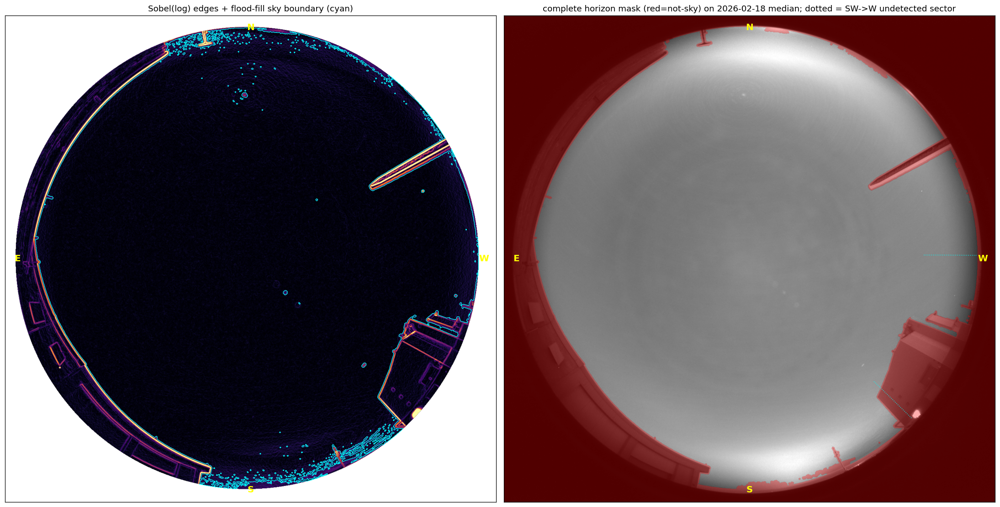
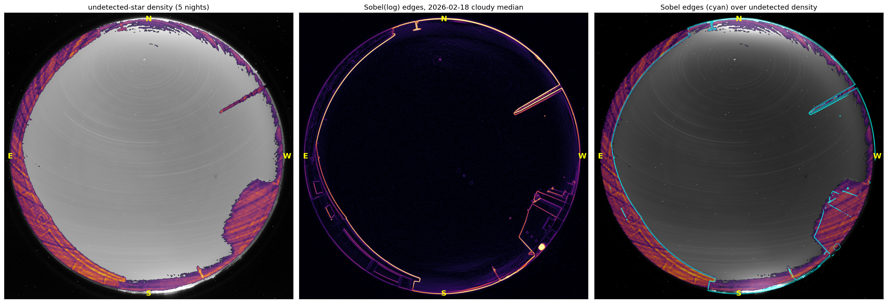
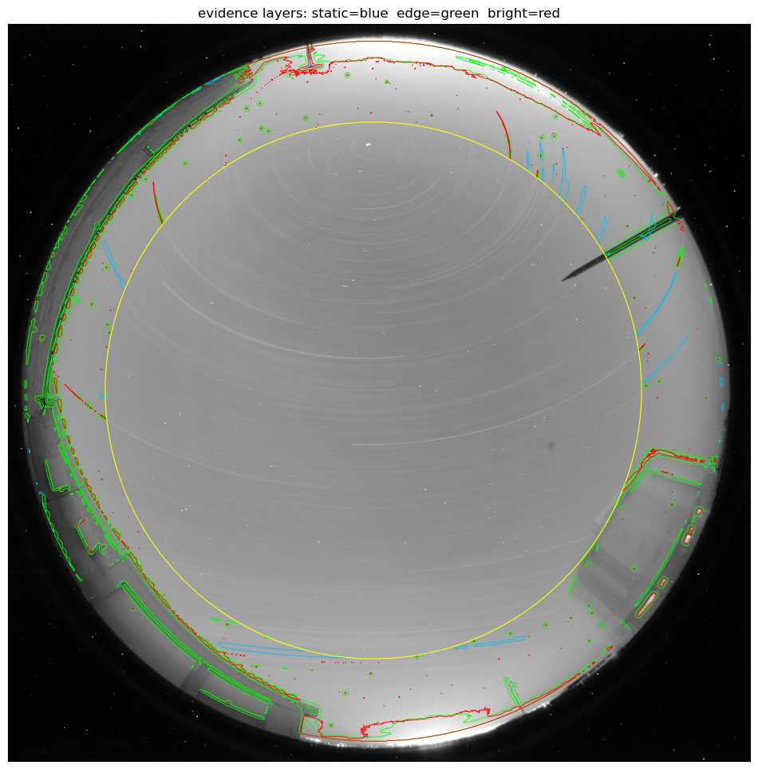

############
Horizon Mask
############

Sky-background and cloud-extinction maps need to know which pixels are actually
sky and which are obstructed — terrain, buildings, and the observatory's
lightning rod. ``skycam_utils`` ships a date-indexed **horizon mask** for this:
:func:`~skycam_utils.alcor.load_alcor_horizon_mask` returns ``(mask, date)``,
where ``mask`` is a 2-D boolean raw-frame array with ``True`` = **not-sky**
(obstructions above the horizon plus everything at or below altitude 0). Valid
sky is therefore ``~mask``.

Properties
==========

- **Achromatic** — one plane shared by R/G/B (unlike the per-channel bad-pixel
  mask).
- **An exclusion mask, not a repair mask** — it is never used to fill pixels,
  only to *select* valid sky for downstream maps.
- **Date-resolved** — loaded by nearest date (overridable with
  ``$ALCOR_HORIZON_DIR``) from
  ``skycam_utils/data/horizon/alcor_horizon_YYYY-MM-DD.fits.gz``, exactly like
  the calibration and bad-pixel assets. It is stable across epochs for the same
  reason the geometry is (see :doc:`wcs_calibration`): one epoch covers
  2024–2026, and a new epoch is added only if the camera moves.

.. code-block:: python

   from skycam_utils.alcor import load_alcor_horizon_mask

   mask, date = load_alcor_horizon_mask("2026-05-18")
   sky = ~mask                          # True where the pixel is valid sky

How the mask is built
=====================

There is **no packaged build CLI** — by design, the regeneration path is the
reference script ``claude_docs/scripts/horizon_floodfill.py``, run offline. The
method is a **Sobel-edge flood-fill of a cloudy-night median**:

1. Take a median stack of a cloudy/overcast night. The smooth, slowly-varying
   overcast sky leaves only the *sharp* obstruction edges.
2. Treat strong ``sobel(log10)`` edges as walls and flood-fill the sky outward
   from the WCS zenith. Everything the fill cannot reach is marked not-sky — so
   the thin, fully-enclosed lightning-rod spike is captured (an earlier radial
   altitude-profile extraction structurally missed it, and an az/alt boolean
   grid was rejected as too coarse).
3. In the SW→W building sector (az 225–270°), where the Sobel edges break up,
   fill instead from the **undetected-star patch**: fixed-position per-frame
   photometry accumulated over five nights, where a persistently high undetected
   fraction marks an obstructed line of sight.
4. A morphological opening (radius 3) severs thin necks so spurious open-sky
   pockets detach, then a connected-component cleanup drops any not-sky blob
   that neither reaches the rim nor is rod-sized.

   The flood-fill horizon mask. Strong Sobel edges of the cloudy-night median
   act as walls; the sky is filled from the zenith, and everything unreachable
   (terrain, buildings, the enclosed lightning-rod spike) becomes not-sky.

   Where the Sobel edges break up in the SW→W building sector, the
   undetected-star patch (high undetected fraction = obstructed) supplies the
   boundary instead.

   Supporting evidence assembled while validating the horizon boundary.

The mask is exercised by the test suite in ``test_alcor_horizon.py``.

See :doc:`reference/index` for the full :mod:`skycam_utils.alcor` API.
