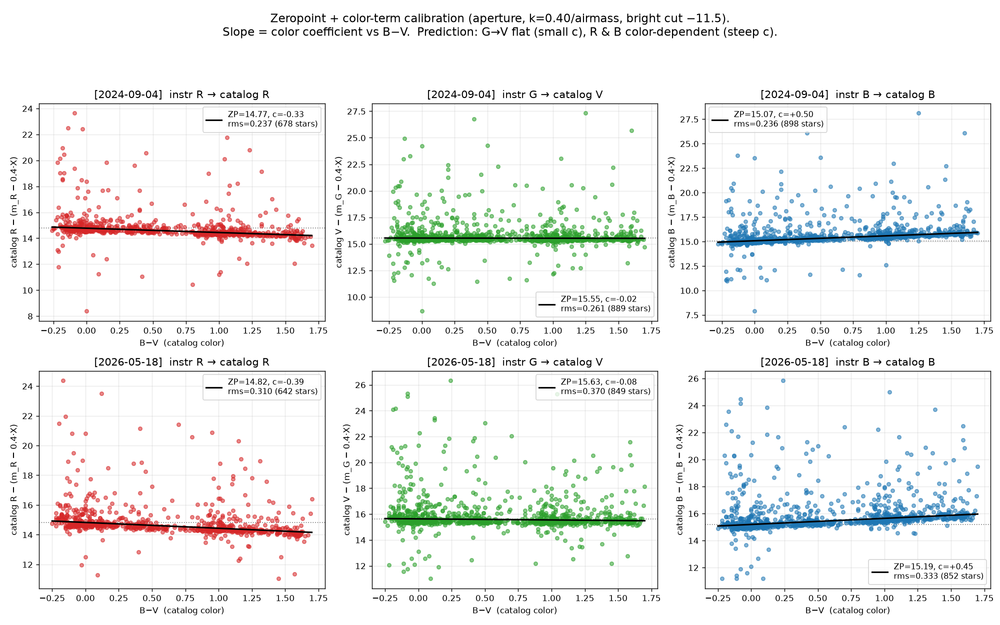
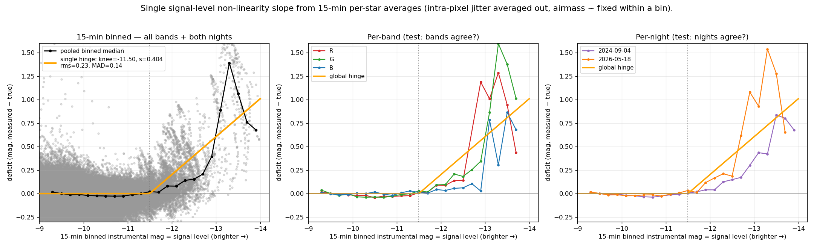
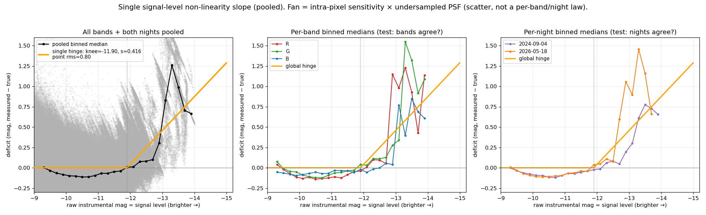

##########
Photometry
##########

Once the WCS pins every star's pixel position (see :doc:`wcs_calibration`),
photometry needs no source-detection step: ``skycam_utils`` measures each named
bright star at its **WCS-predicted** location. This page covers how those
instrumental measurements are made and how they are calibrated onto the catalog
magnitude system, including the per-band colour terms and the CMOS
non-linearity that sets the bright limit.

Measuring instrumental magnitudes
=================================

:func:`~skycam_utils.alcor.alcor_star_photometry` performs fixed-position,
per-channel (R/G/B) photometry of named stars from ``bright_star_sloan_named.fits``
(``Vmag <= --vmag-limit``, default 5.5; above ``--min-altitude``, default 20°).
Key behaviours:

- **Bias** — the per-channel pedestal (median of the four 10×10 image corners)
  is subtracted before measuring. The raw cube from
  :func:`~skycam_utils.alcor.load_alcor_fits` itself stays untouched.
- **Saturation flags** — a per-channel ``sat_*`` boolean is set when *any* raw
  aperture pixel reaches ``--saturation`` (default 32767, the camera's 15-bit
  ceiling). It is checked on the **raw** cube, so a star saturated in one
  channel can be filtered per-channel downstream without losing the others.
- **Non-detections are recorded, not dropped** — every catalog star above
  ``--min-altitude`` produces a row in *every* frame. A star behind cloud is
  recorded per-channel as ``flux = 0`` / ``mag = NaN`` rather than removed,
  because the non-detection is itself a strong extinction signal.
- **Daylight guard** — frames with the Sun above ``--sun-alt-max`` (−12° by
  default) are rejected with a warning and no CSV.

The result is a :class:`pandas.DataFrame` indexed by star name, with
instrumental mags ``-2.5*log10(flux)``; a CSV (``<input>_phot.csv``) is always
written.

.. code-block:: bash

   # Fixed-position RGB aperture photometry of named bright stars
   alcor_star_photometry 2026_05_18__04_30_00.fits.bz2 \
       --aperture-radius 4 --annulus-width 1 --min-altitude 20 --vmag-limit 5.5

   # Overlay the apertures on the rendered frame for a sanity check
   alcor_star_photometry <input.fits> --check-plot

Aperture, Gaussian, and combined modes
======================================

Bright stars expose a CMOS non-linearity that suppresses the aperture-summed
flux *before* true saturation. Two alternative measurement paths address this:

- ``--gaussian`` fits a constrained circular Gaussian whose centre and width are
  pinned from a luminance (R+G+B) fit with the non-linear core masked (raw
  pixels ``>= --mask-threshold``, default 15000, excluded). Each channel's
  amplitude is recovered as the linear projection of the masked,
  background-subtracted aperture onto that fixed unit-Gaussian profile — so the
  *linear wings* set the amplitude — and the analytic integral
  :math:`2\pi A \sigma^2` is reported as ``flux_*``. A shared luminance ``fwhm``
  column is added.
- ``--both`` measures aperture **and** Gaussian in one pass into a single CSV,
  with columns suffixed ``_ap`` / ``_gauss`` (plus the shared WCS-predicted
  ``xcen``/``ycen`` and the Gaussian-fitted ``xcen_gauss``/``ycen_gauss``/``fwhm``).
  Rows sort by ``flux_g_ap``. This is useful for measuring both methods on
  identical frames in one parallelized run for direct comparison.

.. code-block:: bash

   alcor_star_photometry <input.fits> --gaussian          # constrained-PSF flux
   alcor_star_photometry <input.fits> --both              # both in one combined CSV

Photometric calibration
=======================

Every measured magnitude is converted to the catalog system, and
:func:`~skycam_utils.alcor.alcor_star_photometry` always writes two extra
per-channel columns: ``cal_*`` (calibrated catalog-system magnitude) and
``ext_*`` (``cal − catalog`` = the line-of-sight cloud extinction in
magnitudes, positive when the star is dimmer than catalog). The reusable
DataFrame helper is :func:`~skycam_utils.alcor.alcor_calibrate_photometry`,
which applies

.. math::

   m_{\rm cal} = (m_{\rm inst} - k\,X) + {\rm ZP} + c\,(B-V)

with Kasten–Young airmass :math:`X`, a single achromatic extinction term
``ALCOR_AIRMASS_TERM = 0.40`` mag/airmass (no chromatic dependence — the
zeropoints were fit with it held fixed, so they are a matched set), and per-band
``ZP`` / colour coefficient ``c`` from the time-indexed ``ALCOR_ZEROPOINTS``
table (resolved by :func:`~skycam_utils.alcor.alcor_zeropoint`). The
channel→catalog mapping is **G→V**, **R→R** (= V − (V−R)), **B→B** (= V + (B−V)).

``cal_*`` / ``ext_*`` are ``NaN`` where the instrumental magnitude is brighter
than ``ALCOR_BRIGHT_CUT = -12.5`` (the CMOS non-linear regime — see below) or
where the star lacks a catalog colour.

Colour terms
============

The colour terms are where the per-channel structure of the calibration shows
up most clearly. Each channel's response is fit as ``catalog − (m_inst − 0.4·X)``
regressed against the catalog colour ``B−V``: the intercept is the zeropoint and
the **slope is the colour coefficient**. The prediction is that the green
channel tracks Johnson *V* closely (small slope) while R and B, with bandpasses
offset from V, carry real colour terms.

   Zeropoint + colour-term calibration (aperture mags, ``k = 0.40``/airmass).
   Each panel regresses ``catalog − (m_inst − 0.4·X)`` against ``B−V``; the
   slope is the colour coefficient. **Top:** 2024-09-04. **Bottom:** 2026-05-18.
   **G→V** is nearly flat (``c ≈ -0.02`` to ``-0.08``), while **R→R**
   (``c ≈ -0.33`` to ``-0.39``) and **B→B** (``c ≈ +0.45`` to ``+0.50``) are
   strongly colour-dependent — exactly as the instrument bandpasses predict.
   Adding the colour term collapses the scatter dramatically (e.g. the R-band
   RMS drops from ~0.63 to ~0.24 mag).

The zeropoints are **stable to ~0.03 mag across the 2024 and 2026 epochs**,
mirroring the geometric stability documented in :doc:`wcs_calibration`. This
stability across ~21 months, with no camera intervention, is what justifies
treating a single calibration as effectively stationary.

CMOS non-linearity and the bright cut
=====================================

For bright stars (roughly ``V < 3``) the measured flux is suppressed before the
pixels saturate — a property of the signal level, not of any particular band.
The deficit was characterized with 15-minute per-star medians (which average out
the intra-pixel-sensitivity × undersampled-PSF jitter), revealing a single,
band- and night-independent function of signal level.

   The bright-star magnitude deficit as a function of instrumental signal level
   (15-minute binned). The deficit onsets near ``-11.5`` but stays small and
   roughly linear (~0.15–0.20 mag/mag) out to ``-12.5``, then accelerates
   steeply into a sparse, inconclusive regime.

Because the deficit stays small and nearly linear out to ``-12.5`` before
accelerating, ``ALCOR_BRIGHT_CUT`` was set there: measurements brighter than
``-12.5`` are flagged non-linear and their ``cal_*`` / ``ext_*`` are set to
``NaN``. The Gaussian path does **not** rescue this regime — the PSF is
undersampled, so the constrained fit inherits the same core suppression.

   Combined view of the deficit across bands and nights, showing the collapse
   onto a single signal-level relation.

Building light curves across a night
====================================

:func:`~skycam_utils.alcor.collect_alcor_photometry` gathers a set of per-frame
CSVs (a directory globbed for ``*_phot.csv``, or an explicit path list) into one
DataFrame with a UT ``OBSTIME`` column parsed from each
``YYYY_MM_DD__HH_MM_SS`` filename, sorted by ``name`` then ``OBSTIME`` — so
``df.groupby("name")`` yields each star's time-ordered light curve for
calibration against catalog photometry. It is column-agnostic (it only needs
``name``), so the wider ``--both`` schema flows through unchanged.

.. code-block:: python

   from skycam_utils.alcor import collect_alcor_photometry

   df = collect_alcor_photometry("<skycam_datadir>/2026-05-18")
   for name, lc in df.groupby("name"):
       ...  # lc is one star's time-ordered light curve

See :doc:`reference/index` for the full :mod:`skycam_utils.alcor` API.
