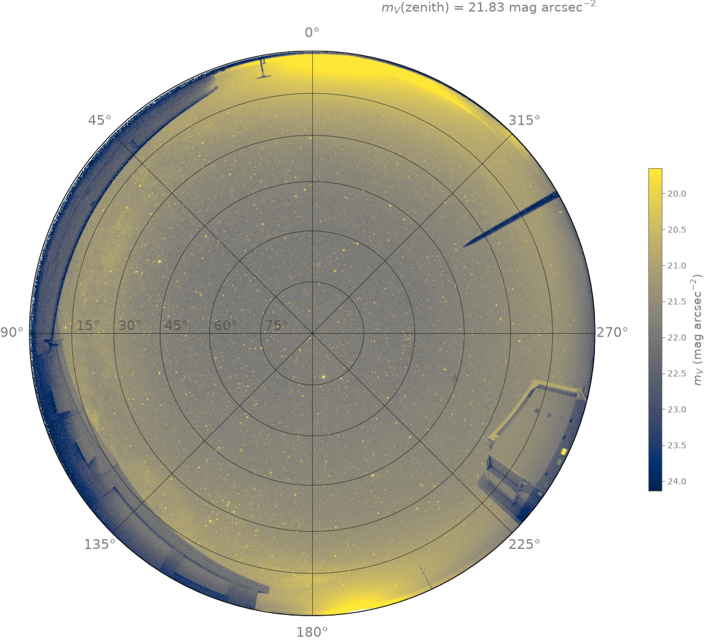

##############
Sky Brightness
##############

The same WCS geometry and photometric zeropoints that calibrate point sources
(see :doc:`wcs_calibration` and :doc:`photometry`) can also turn an Alcor OMEA frame into
a calibrated **surface-brightness map** in V mag/arcsec². This is what
:func:`~skycam_utils.alcor.plot_alcor_sky_brightness` produces, and it is the
natural tool for quantifying airglow as well as light pollution, both overall and
in specific regions affected by localized sources. The OMEA **G** channel maps very closely
to a standard **V** bandpass, as shown in :doc:`photometry`. The sky brightness
values produced can thus be directly compared to other sky quality monitor (SQM) measurements
that are also calibrated to the standard **V** bandpass.

What it measures
================

The map converts the corner-bias-subtracted **G** channel to an **observed**
V mag/arcsec². There is **no airmass term** applied because it is only appropriate
for signals that originate from outside the atmosphere. Light pollution comes from
below most of the atmosphere and is reflected light. Airglow occurs at different altitudes
within the atmosphere and the Milky Way, of course, comes from outside the atmosphere, but they need
to be treated as observed brightnesses to compare directly with light pollution.

The conversion chain has no free parameters:

1. **Exposure-normalize** the raw counts to the calibration's 20 s reference
   (``ALCOR_CALIB_EXPTIME``, read from the ``EXPOSURE`` header — counts are
   linear in exposure).
2. **Divide by the per-pixel solid angle**, computed *exactly from the WCS*
   (:func:`~skycam_utils.alcor._alcor_pixel_solid_angle`: the unit-vector
   Jacobian via finite differences). This captures both the ``ARC``
   zenith→horizon plate-scale change *and* the SIP distortion — assuming a flat
   plate scale would be wrong by ~0.5 mag.
3. **Apply the G→V zeropoint** from ``ALCOR_ZEROPOINTS``.

Pixels with raw G ``>= ALCOR_SB_SATURATION = 25000`` (clipped / strongly
non-linear, well below the 15-bit saturation) are masked, and non-sky is masked
either by an altitude floor (``--fov-altitude``, default −2°) or, with
``--horizon-mask``, by :func:`~skycam_utils.alcor.load_alcor_horizon_mask` (see
:doc:`horizon_mask`).

End-to-end validation
=====================

A clear, dark frame lands at a **sigma-clipped median zenith brightness of
≈ 21.5–21.6 mag/arcsec²** (above altitude 85°, annotated in the figure
corner). Recovering that canonical dark-sky value with *no free parameters*
validates the whole exposure → solid-angle → zeropoint chain end to end.

   An Alcor sky-brightness map: the G channel converted to observed
   V mag/arcsec² (exposure-normalized to 20 s, divided by the exact WCS
   per-pixel solid angle, G→V zeropoint, no airmass term). The ``cividis_r``
   colorbar runs bright-sky-light; the annotated zenith median lands near the
   canonical dark-sky value.

Usage
=====

.. code-block:: bash

   # Auto-scaled map (range varies with moonlight); altitude-floor masking
   plot_alcor_sky_brightness 2026_05_18__04_30_00.fits.bz2 -o frame_skybright.pdf

   # Use the full horizon mask and fix the colour scale
   plot_alcor_sky_brightness <input.fits> --horizon-mask --vmin 18 --vmax 22

The renderer reuses the same zenith crop and alt/az polar grid as
:func:`~skycam_utils.alcor.plot_alcor_fits` (both call the shared
``_alcor_zenith_crop_bounds`` / ``_add_alcor_alt_az_grid`` helpers), so the
surface-brightness map and the annotated all-sky figure are framed identically.

See :doc:`reference/index` for the full :mod:`skycam_utils.alcor` API.
