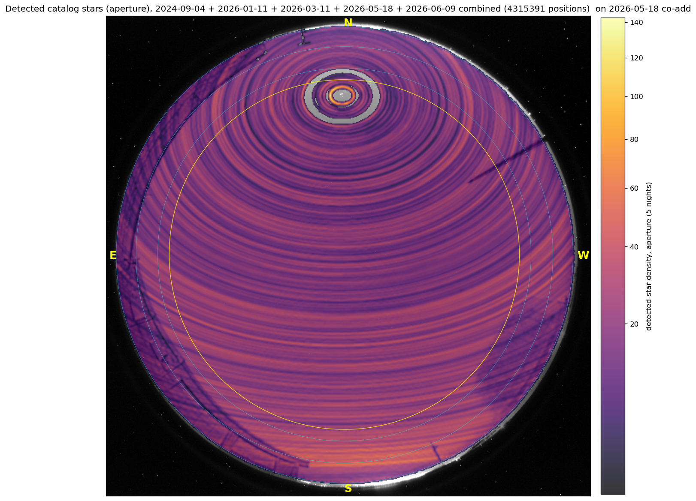

################
WCS Calibration
################

The Alcor all-sky camera images the whole visible sky onto a single RGB CMOS
sensor. To do anything quantitative with that frame — measure a named star,
mask the horizon, build a sky-brightness map — every pixel must map to a
direction on the sky. ``skycam_utils`` solves this once, by attaching a full
:class:`~astropy.wcs.WCS` to the raw frame that maps **pixel ↔ (azimuth,
altitude)**. The WCS *is* the geometry; nothing downstream re-derives it.

The geometric model
===================

The fitted WCS is an ``ARC`` (zenithal equidistant) projection — the natural
projection for an all-sky lens, where radial distance from the zenith is
proportional to zenith angle — augmented with several physical corrections.
Altitude 0 (the horizon) falls at ``horizon_radius`` pixels from the zenith.
The model encodes, in order of magnitude:

- **Zenith offset** — the sky's zenith is not at the sensor centre; the offset
  lives in ``CRPIX``.
- **Camera rotation** — a pure rotation in the ``PC`` matrix (determinant +1).
  Because an all-sky camera images the sky *from below*, the sky/sensor
  handedness is carried by the azimuth convention (``rotation - az``), so north
  lands toward +y.
- **Radial lens distortion** — the odd-power (``k3``/``k5``) departure of the
  real lens from a perfect ``ARC`` mapping, encoded as an **exact analytic SIP**
  distortion.
- **Tangential decentering** — Brown–Conrady ``P1``/``P2`` terms (exact degree-2
  SIP) that absorb the sensor-tilt signature: a once-per-azimuth residual that
  grows as :math:`r^2`.
- **Optical-axis tilt** — a world-side tilt (``axis_tilt``, in degrees toward
  north/east) encoded as the WCS pole: ``CRVAL = (A0, 90 − ε)`` with
  ``LONPOLE = A0``. With nonzero tilt the optical-axis pixel
  (``xcen``/``ycen``) is **not** the zenith; the zenith must be located through
  the WCS (where ``alt = 90``), not read from ``CRPIX``.

Every one of these is a real, physically-motivated degree of freedom, and each
was added only after the residuals demanded it. The fitted geometry is a set of
absolute raw-frame constants — ``xcen``, ``ycen``, ``rotation``,
``radial_coeffs``, ``tangential_coeffs``, ``axis_tilt``, ``horizon_radius`` —
stored in the time-indexed ``ALCOR_CALIBRATIONS`` table in
:mod:`skycam_utils.alcor`.

Loading a frame and its WCS
===========================

:func:`~skycam_utils.alcor.load_alcor_fits` returns the raw ``(3, ny, nx)`` RGB
cube **untouched** — no transpose, trim, rotation, shift, flip, or bias
subtraction (only optional bad-pixel repair) — together with the raw-frame WCS
and a bad-pixel mask, as the 3-tuple ``(cube, wcs, mask)``. When called without
an explicit ``wcs=``, it resolves the calibration epoch nearest the frame's time
(from the filename timestamp, falling back to the ``DATE`` header) and builds the
WCS for that era, so frames from 2024 and 2026 each get the correct geometry.

.. code-block:: python

   from skycam_utils.alcor import load_alcor_fits

   # WCS is resolved automatically from the frame's epoch
   cube, wcs, mask = load_alcor_fits("2026_05_18__04_30_00.fits.bz2")

   # pixel -> world (azimuth, altitude) and back
   az, alt = wcs.all_pix2world(xpix, ypix, 0)

Fitting the calibration
=======================

The calibration is produced by :func:`~skycam_utils.alcor.fit_alcor_wcs`, which
aggregates bright-star matches across **all dark frames of a whole night** and
prints a ready-to-paste ``ALCOR_CALIBRATIONS`` epoch dict (stamped with the
night's UT date) to add to ``alcor.py`` and commit.

- **Reference catalog** — ``bright_star_sloan.fits``, stars with ``Vmag <= 4``.
- **Dark-frame selection** — only frames with Sun ``< −18°`` *and* Moon
  ``< −6°`` are used; moonlight scatter swamps the faint star field and corrupts
  detection. Frame times are parsed from the ``YYYY_MM_DD__HH_MM_SS`` filename
  (local MST = UT − 7), so the selector never opens files it will reject.
- **Detection** runs on the **bad-pixel-repaired** cube — otherwise hot pixels
  masquerade as stars.
- **Matching** (:func:`~skycam_utils.alcor.assign_alcor_matches`) is seeded by
  the nearest epoch's geometry and uses a ``cKDTree`` candidate search with
  local-asterism pattern verification and a local *relative*-brightness
  tie-break (cloud extinction is patchy, so only relative flux among nearby
  contested stars is trusted) — there is no per-frame geometry refit. The match
  tolerance tightens over several rounds from ~12 px down to ``--tolerance``
  (~3 px).

.. code-block:: bash

   # Aggregate a night and print an ALCOR_CALIBRATIONS epoch dict
   fit_alcor_wcs <skycam_datadir>/2026-05-18 \
       --vmag-limit 4 --tolerance 3 --residual-plot 2026-05-18_resid.png

   # Per-frame load/detect is parallelized; --quiet silences per-file disposition
   fit_alcor_wcs <night-dir> --workers 8 --quiet

Fit quality
===========

On clean dark frames the fit matches ~80 stars per frame. With the full model
(``k5`` + ``P1``/``P2`` + axis tilt) a healthy fit reaches a **matched fraction
near 0.7** and a **pooled RMS of ~0.35 px**. The residual floor is *not* noise:
it is a smooth, azimuthally-symmetric ~0.6 px peak-to-peak radial wiggle, the
signature of truncating the ``k3``/``k5`` radial polynomial. It is not worth
chasing with more terms.

The figure below overlays the WCS-predicted positions of catalog bright stars
on a real dark frame. Tight agreement across the full field — from zenith to
horizon, and at all azimuths — is the visual confirmation that the projection,
distortion, and tilt terms are all pulling their weight.

   Bright-star catalog positions predicted by the fitted WCS, overlaid on a
   dark Alcor frame. Agreement holds from the zenith out to the horizon and at
   every azimuth.

Cross-epoch stability
=====================

A primary validation of the whole geometry pipeline is that the camera was
**not moved or refocused between the 2024-09 and 2026-05 epochs** (~21 months
apart), and the two independently-fit geometries agree to within the fit
uncertainty:

- centre stable to ~1 px,
- rotation stable to ~0.05°,
- axis tilt stable to ~0.03–0.04°,
- *identical* ``horizon_radius`` (747.2).

This matches the ~0.03 mag photometric-zeropoint stability over the same span
(see :doc:`photometry`). A single calibration is therefore effectively
stationary; the per-epoch entries in ``ALCOR_CALIBRATIONS`` exist only as a
safety net should the camera ever be moved. The agreement is itself a strong
end-to-end check: it underpins, for example, stacking both nights' results in a
common frame.

Rendering and writing frames
============================

Two CLIs consume the WCS for visualization and archival:

.. code-block:: bash

   # Annotated north-up all-sky figure (crops a --radius square around the
   # WCS zenith; --radius is the display crop only)
   plot_alcor_fits 2026_05_18__04_30_00.fits.bz2 -o frame.pdf --radius 680

   # Write the raw cube + WCS header in native orientation (DS9 shows the
   # camera's native frame while the WCS still resolves correctly)
   alcor_proc_fits 2026_05_18__04_30_00.fits.bz2 -o frame_proc.fits

See :doc:`reference/index` for the full :mod:`skycam_utils.alcor` API.
